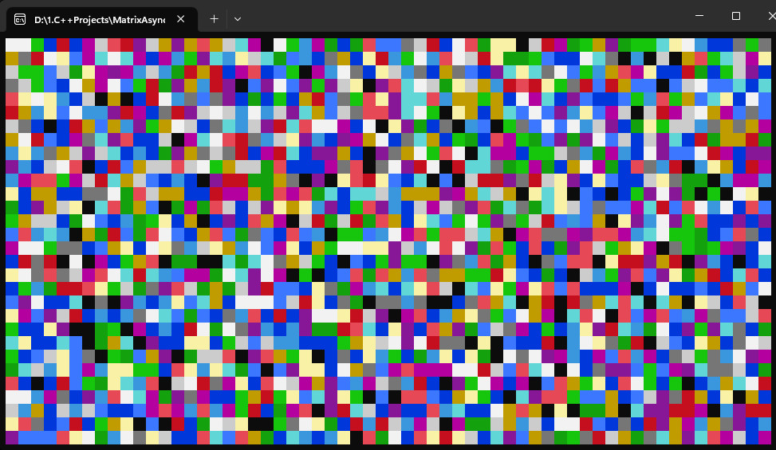

# GB-ScreenSaverRandomColors

This is a simple program that creates a screensaver effect by generating random colors and printing them to the console window. It uses ASCII characters to create patterns and continuously refreshes the screen to create an animated effect.

## Getting Started

To run the program, follow these steps:

1. Open a C++ development environment.
2. Copy the code from the `ConsoleApplication1.cpp` file in this repository.
3. Compile and run the code.
4. Sit back and enjoy the screensaver effect!

## Prerequisites

- C++ development environment
- Windows operating system

## Code Explanation

The program uses the following libraries:

- `Windows.h` - for Windows-specific functions and data types
- `iostream` - for input and output operations

The program defines several ASCII characters for creating patterns and defines macros for convenience.

The main function performs the following steps:

1. Sets the random seed using the current time.
2. Sets the console output code page to 437 for proper character rendering.
3. Creates a console screen buffer and makes it the active screen buffer.
4. Initializes a buffer to store the characters and attributes for the console.
5. Enters an infinite loop to continuously refresh the screen with random colors and patterns.

## Customization

You can customize the screensaver by modifying the code. Here are a few suggestions:

- Adjust the size of the console by changing the dimensions in the `SMALL_RECT` structure.
- Modify the patterns by changing the ASCII characters assigned in the switch-case statements.
- Experiment with different color ranges by modifying the attributes assigned to the console buffer.

Feel free to explore and make changes to create your unique screensaver!
